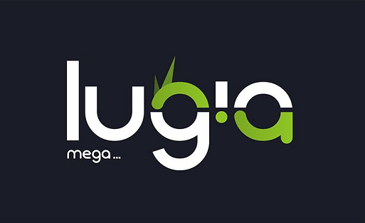

# Lugia Mega

> 标准、高效、开箱即用的前端可视化设计开发工具



- [设计](./docs/design)

## Development, Contribute

```bash
$ git clone http://repo
```

> 安装 [yarn](https://yarnpkg.com)

```bash
# 安装依赖
$ yarn
```

> 使用 [lerna](https://github.com/lerna/lerna) 管理 packages

```bash
# 引导安装所有 packages 的依赖
$ yarn bootstrap
```

### 开发

使用 babel 转义并监听所有的改动文件

```bash
$ yarn start
```

### 测试

```bash
$ yarn test
```

### 生产构建

```bash
$ yarn build
```

### 运行单个 package 的测试

```bash
$ yarn run lerna exec --scope mega-webpack -- yarn run test
```

### 发布 package 到 npm 或 私服

```bash
$ yarn run publish

## 发 alpha 版本
$ yarn run publish -a

# 忽略
$ yarn run publish -- --ignore mega-webpack
```

## 看 packages/\*/README.md
