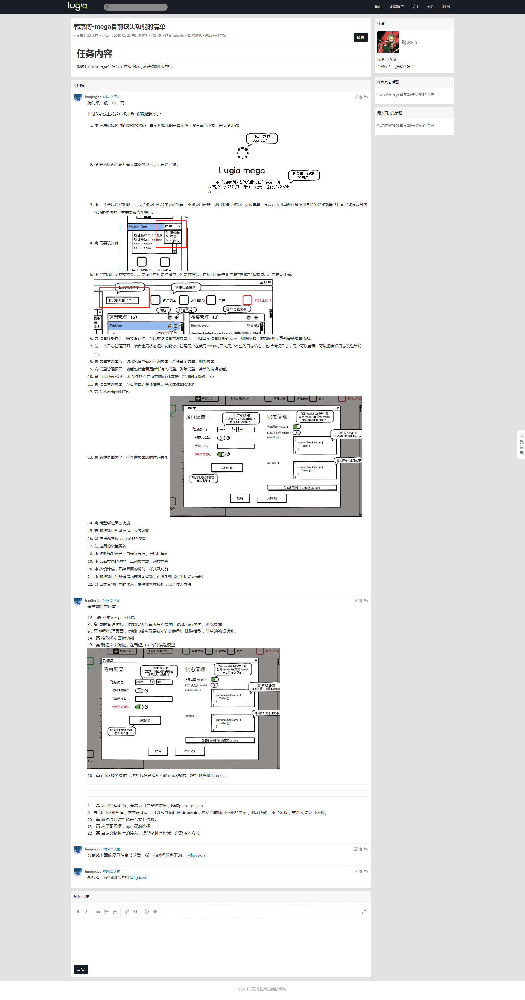

# TODO

## import { isPlainObject } from '@lugia/mega-utils/lib/is';

## mega-webpack 的配置文件调整

[cosmiconfig](https://github.com/davidtheclark/cosmiconfig)

配置文件需要单独做一个包，以便供其他包使用用户的配置项

lugia.config.js

## lib ~ src sourcemap

## mega-scripts

- ~~[browser-sync](https://github.com/BrowserSync/browser-sync)~~
- ~~mock: 支持引入 json、excel、csv 格式的文件作为数据来源~~

proxy 代理的配置需要丰富，参考 [a](https://webpack.js.org/configuration/dev-server/#devserver-proxy)，[b](https://github.com/webpack/webpack-dev-server/blob/master/lib/Server.js)，直接在 mock.config.js 中加一个 proxy 字段做配置扩展，使用 http-proxy-middleware

browser-sync 热更新时命令行不刷新界面

## use [react-hot-loader](https://github.com/gaearon/react-hot-loader)

## [HMR] 支持

## webpack 4

## BUG

### packages/mega-webpack/test/build.test.js

```
F:\yssgitlab\lugia-mega\packages\mega-webpack\node_modules\loader-runner\
lib\loadLoader.js:35
                        throw new Error("Module '" + loader.path + "' is not a loader (must have normal or
pitch function)");
                        ^

Error: Module 'F:\yssgitlab\lugia-mega\packages\mega-webpack\lib\debugLoader.js' is not a loader (must have
 normal or pitch function)
    at loadLoader (F:\yssgitlab\lugia-mega\packages\mega-webpack\node_modules\loader-runner\lib\loadLoader.
js:35:10)
    at iteratePitchingLoaders (F:\yssgitlab\lugia-mega\packages\mega-webpack\node_modules\loader-runner\lib
\LoaderRunner.js:169:2)
    at runLoaders (F:\yssgitlab\lugia-mega\packages\mega-webpack\node_modules\loader-runner\lib\LoaderRunne
r.js:362:2)
    at NormalModule.doBuild (F:\yssgitlab\lugia-mega\packages\mega-webpack\node_modules\webpack\lib\NormalM
odule.js:182:3)
    at NormalModule.build (F:\yssgitlab\lugia-mega\packages\mega-webpack\node_modules\webpack\lib\NormalMod
ule.js:275:15)
    at Compilation.buildModule (F:\yssgitlab\lugia-mega\packages\mega-webpack\node_modules\webpack\lib\Comp
ilation.js:157:10)
    at moduleFactory.create (F:\yssgitlab\lugia-mega\packages\mega-webpack\node_modules\webpack\lib\Compila
tion.js:460:10)
    at factory (F:\yssgitlab\lugia-mega\packages\mega-webpack\node_modules\webpack\lib\NormalModuleFactory.
js:243:5)
    at applyPluginsAsyncWaterfall (F:\yssgitlab\lugia-mega\packages\mega-webpack\node_modules\webpack\lib\N
ormalModuleFactory.js:94:13)
    at F:\yssgitlab\lugia-mega\packages\mega-webpack\node_modules\tapable\lib\Tapable.js:268:11
    at NormalModuleFactory.params.normalModuleFactory.plugin (F:\yssgitlab\lugia-mega\packages\mega-webpack
\node_modules\webpack\lib\CompatibilityPlugin.js:52:5)
    at F:\yssgitlab\lugia-mega\packages\mega-webpack\node_modules\tapable\lib\Tapable.js:270:14
    at fileExistsWithCase (F:\yssgitlab\lugia-mega\packages\mega-webpack\node_modules\case-sensitive-paths-
webpack-plugin\index.js:160:11)
    at that.fileExistsWithCase (F:\yssgitlab\lugia-mega\packages\mega-webpack\node_modules\case-sensitive-p
aths-webpack-plugin\index.js:112:7)
    at that.fileExistsWithCase (F:\yssgitlab\lugia-mega\packages\mega-webpack\node_modules\case-sensitive-p
aths-webpack-plugin\index.js:112:7)
    at CaseSensitivePathsPlugin.Object.<anonymous>.CaseSensitivePathsPlugin.fileExistsWithCase (F:\yssgitla
b\lugia-mega\packages\mega-webpack\node_modules\case-sensitive-paths-webpack-plugin\index.js:82:5)
    at that.getFilenamesInDir (F:\yssgitlab\lugia-mega\packages\mega-webpack\node_modules\case-sensitive-pa
ths-webpack-plugin\index.js:105:10)
    at CaseSensitivePathsPlugin.Object.<anonymous>.CaseSensitivePathsPlugin.getFilenamesInDir (F:\yssgitlab
\lugia-mega\packages\mega-webpack\node_modules\case-sensitive-paths-webpack-plugin\index.js:50:5)
    at CaseSensitivePathsPlugin.Object.<anonymous>.CaseSensitivePathsPlugin.fileExistsWithCase (F:\yssgitla
b\lugia-mega\packages\mega-webpack\node_modules\case-sensitive-paths-webpack-plugin\index.js:88:8)
    at that.getFilenamesInDir (F:\yssgitlab\lugia-mega\packages\mega-webpack\node_modules\case-sensitive-pa
ths-webpack-plugin\index.js:105:10)
    at Array.fs.readdir (F:\yssgitlab\lugia-mega\packages\mega-webpack\node_modules\case-sensitive-paths-we
bpack-plugin\index.js:66:5)
    at Storage.Object.<anonymous>.Storage.finished (F:\yssgitlab\lugia-mega\packages\mega-webpack\node_modu
les\webpack\node_modules\enhanced-resolve\lib\CachedInputFileSystem.js:40:15)
    at F:\yssgitlab\lugia-mega\packages\mega-webpack\node_modules\webpack\node_modules\enhanced-resolve\lib
```

## v1.0.0



- [ ] 可以将 SVG 作为一个 React 组件导入，还可以在 JSX 中使用这个 SVG
      [Transform SVGs into React components](https://github.com/smooth-code/svgr)

- [ ] @lugia/mega-polyfill
      This package includes polyfills for various browsers.
      [react-app-polyfill](https://github.com/facebook/create-react-app/tree/master/packages/react-app-polyfill)

- [ ] [Workbox service worker](https://github.com/facebook/create-react-app/pull/4169)

- [ ] 性能优化

- [ ] Set baseUrl from jsconfig.json/tsconfig.json
      https://github.com/facebook/create-react-app/pull/6656

- [ ] Adds PostCSS Normalize
      https://github.com/facebook/create-react-app/pull/5810

- [ ] Support React Hooks
      https://github.com/facebook/create-react-app/pull/5997

- [ ] Update to core-js@3
      https://github.com/facebook/create-react-app/pull/6769
      https://babeljs.io/blog/2019/03/19/7.4.0#core-js-3-7646-https-githubcom-babel-babel-pull-7646

- [ ] .graphql and .gql file loading with graphql.macro
      https://github.com/facebook/create-react-app/pull/5481

- [ ] move the TypeScript codebase from TSLint to typescript-eslint
      https://github.com/typescript-eslint/typescript-eslint
      https://github.com/facebook/create-react-app/pull/6513

- [ ] 优化 browserslist 的配置项在 babel、autoprefixer
      区分生产和开发环境？
      https://github.com/facebook/create-react-app/pull/6608

- [x] ~~_@lugia/mega-jest_~~ [2019-04-30]
      更新到 Jest 24
      https://github.com/facebook/create-react-app/pull/6278

- [ ] Getting Started With Plug'n'Play
      https://gist.github.com/arcanis/02b49752c385908479734d8027d7a6c7
      https://github.com/facebook/create-react-app/pull/5269

- [ ] @lugia/mega-config
      lugia.config.js
      [cosmiconfig](https://github.com/davidtheclark/cosmiconfig)
      [craco](https://github.com/sharegate/craco/blob/master/packages/craco/README.md)
      [react-app-rewired](https://github.com/timarney/react-app-rewired)

## NEXT v2

- [ ] 插件体系
      插件式，支持热插拔
      [webpack-chain](https://github.com/neutrinojs/webpack-chain)
