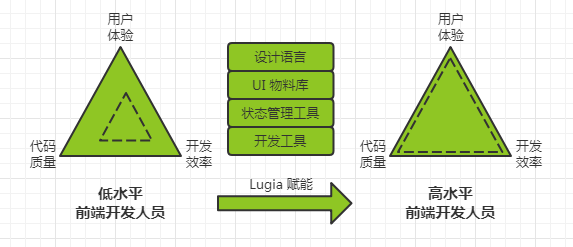

# Lugia MEGA

**一个基于前端物料库体系的可视化开发工具**

> 高效、开箱即用、标准的前端工程化开发体验

## 相关

* 前端技术更新迭代速度快，业务开发人员由于需要花费大量时间在业务实现上，对前端的技术选型、实现方案、用户体验无法有效把控
* 前端开发人员不足、技术水平不高，无法保证效率和质量
* 前端发展到现在，在技术实现和开发方式上已经有了成熟丰富、多种多样的方案；需要对这些方案进行整合优化，以提高开发效率、代码质量和用户体验

在前端工程化方向上，可视化、屏蔽底层、提供元信息式的开发方式已经成为主流。

`lugia-mega` 就是为了解决这些问题的，它也是 `多端一体化` 研发成果对外输出的主要承载体。

## 愿景

给低水平的开发人员赋能，降低开发成本，提升前端开发质量

| 名词             | 解释                                                                                                                                                                                                                                                           |
| ---------------- | -------------------------------------------------------------------------------------------------------------------------------------------------------------------------------------------------------------------------------------------------------------- |
| 设计语言         | `lugiad` 设计语言（一种规范），提供专业的视觉指导，提高用户体验                                                                                                                                                                                                |
| 物料库           | 在 `lugia` 中，组件、区块、布局、模板等统称为物料，由 `lugia` 团队维护，在内部有一套完整的开发规范和工具；基于此，你可以参与共建，也可以自建私有的物料库。                                                                                                     |
| 官方物料库       | 由 `lugia` 团队开发维护的物料库，质量保证，提供技术支持                                                                                                                                                                                                        |
| 私有物料库       | 由业务团队开发维护的私有物料库；在实际项目中，官方提供的物料库和设计风格可能不能满足某些业务场景，这时可以自定义内部的私有物料库                                                                                                                               |
| 物料库开发者工具 | 我们提供了物料库开发者工具 `lugia-devtool` 来满足自定义私有物料库的能力，支持自定义接入 React 的区块、布局、模板等功能；官方物料库也是使用这个工具进行开发维护的，通过这个工具你可以参与官方物料库的共建                                                       |
| 组件             | 最基础的物料，具有高度可复用性；包含三端：`lugia-web`（web 端）、`lugia-mobile`（移动端）、`lugia-desktop`（桌面端）                                                                                                                                           |
| 区块             | 通过对大量的系统常用的场景进行分类、对比和抽象，基于基础组件组合而成，可以通过 `lugia-mega` 进行快速组合搭建应用，减少重复的开发，提升效率                                                                                                                     |
| 布局             | 我们提供了一些常见的页面布局，并且有一个更加灵活的布局系统，支持自定义布局                                                                                                                                                                                     |
| 模板             | 基于已有的区块搭建而成，我们提供了一些特定领域的模板；可以从零开始搭建应用，也可以选择特定类型的模板快速开始                                                                                                                                                   |
| 状态管理工具     | [现代 js 框架主要在解决 UI 与状态同步的难题](https://github.com/dt-fe/weekly/blob/master/57.%E7%B2%BE%E8%AF%BB%E3%80%8A%E7%8E%B0%E4%BB%A3%20js%20%E6%A1%86%E6%9E%B6%E5%AD%98%E5%9C%A8%E7%9A%84%E6%A0%B9%E6%9C%AC%E5%8E%9F%E5%9B%A0%E3%80%8B.md)，`redux-lugia` |
| 开发工具         | `lugia-mega`，一个基于前端物料库体系的可视化开发工具，提供高效、开箱即用、标准的前端工程化开发体验                                                                                                                                                             |

## 特性

* 高效：丰富模板、海量物料、可视化操作、极速构建前端应用、轻松管理所有项目
* 开箱即用：无需环境搭建、简单配置、快速上手、跨平台（Mac 和 Windows）
* 标准的前端工程化开发体验：开发环境配置、初始化、开发调试、构建、依赖管理、项目管理、Mock 服务、代理配置...... 贯穿整个项目的生命周期

## 功能

### 模板自定义创建

提供多种垂直领域模板，快速创建项目，支持风格切换，满足个性化需求

### 区块可视化组装

海量物料自由搭配，轻松完成页面组合可视化操作更得心应手

### 布局自定义生成

模板内置布局，同时有一个更加灵活的布局系统，提供交互式的定制功能生成自定义布局

### 物料自定义接入

官方提供海量的物料，覆盖多种业务场景，也支持物料自定义接入，定制物料源

### 专注于业务开发

屏蔽技术细节，让开发者专注于业务实现，保证开发效率和代码质量；进行最前沿最可靠的技术选型，提供性能优化方案，为业务赋能

## 浏览器兼容性

|  |  |  |  |  |  |  |
| :--------------------------------------------------------------------------------------: | :-----------------------------------------------------------------------------------------: | :--------------------------------------------------------------------------------: | :--------------------------------------------------------------------------------------------------------------------------: | :--------------------------------------------------------------------------------------: | :-----------------------------------------------------------------------------------: | :--------------------------------------------------------------------------: |
|                                            ✔                                             |                                              ✔                                              |                                         ✔                                          |                                                            10+ ✔                                                             |                                            ✔                                             |                                           ✔                                           |                                      ✔                                       |
