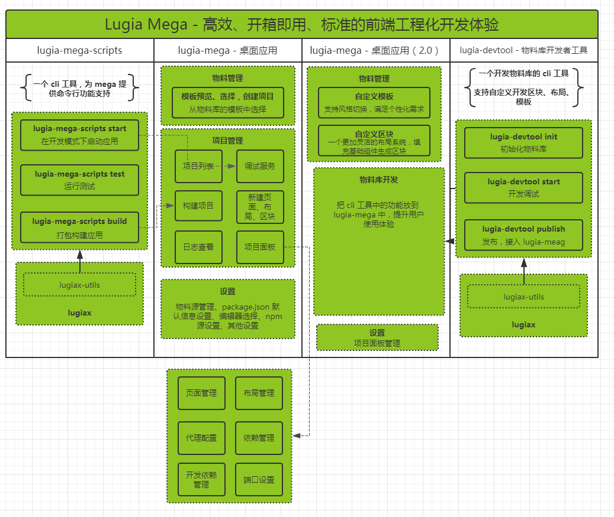

# lugia-mega 功能设计

`lugia-mega`，是一个基于前端物料库体系的可视化开发工具，提供高效、开箱即用、标准的前端工程化开发体验。

## 优点

现在我们开发一个应用，通常使用 [Create React App](https://github.com/facebook/create-react-app)、[vue-cli](https://github.com/vuejs/vue-cli) 这些命令行工具的形式，而 `lugia-mega` 是一个可视化的桌面应用（以下简称 mega），这会带来以下方面的优点：

* 无需再配置复杂的系统环境、环境变量等
* 无需再安装复杂的 Node.js 环境
* 有效的管理起每个项目下体积大、版本混乱的依赖项（node_moduels）

通过依赖 mega 内置固定版本的 Node.js 环境以及依赖管理功能，因而隔离外部环境，不用再安装配置各种各样的系统环境以及依赖。

## 如何使用

我们提供 macOS、Windows 64 两个主流系统的桌面应用，若需要其他系统的应用，我们也会根据实际情况进行支持。

只需简单的下载、解压，即可开始愉快地开发各种前端应用。

## 下载

在 [Lugia](https://lugia.tech) 网站上进行下载。

## 安装

**Windows 64 系统版本的客户端**

仅需要解压下载的压缩包，双击运行 lugia_mega.exe。

**macOS 系统的客户端**

下载完成后打开 dmg 文件。

若出现 “不明开发者...” 的提示无法打开的话，请打开 系统设置>安全性与隐私>通用 允许打开应用。

成功打开 dmg 后，拖动 app 到 应用程序 文件夹后，双击打开即可运行。

## 用户界面

因系统的差异性，macOS 与 Windows 64 两个系统版本的应用界面上会有所差别，但功能上相差无几。

使用文档里会以 macOS 系统的界面作为例子，进行说明。

xxxxx

xxxxx

## 功能架构

* 块需要有自定义名字
