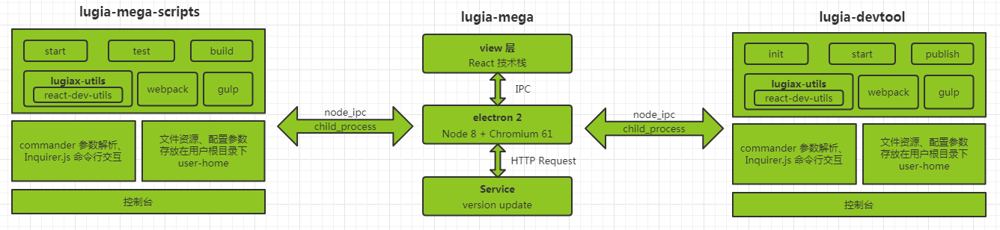

# lugia-mega 实现方案

lugia-mega 基于 [Webpack 4.x](https://github.com/webpack/webpack)、[Gulp 4.x](https://github.com/gulpjs/gulp)、[Babel 7](https://github.com/babel/babel) 进行打包构建工作。

以 [Electron](https://electronjs.org/) 为基础构建框架开发桌面应用，兼容主流的 macOS 以及 Windows 64 系统。

打包构建部分主要由 webpack 来完成。

webpack 专门处理各个资源模块化构建，而 Gulp 补充 webpack 一些功能较为薄弱的环节，例如多线程压缩 css、js，文件监听。

* [commander](https://github.com/tj/commander.js) 让命令行界面开发变得简单
* [react-dev-utils](https://github.com/facebook/create-react-app/blob/next/packages/react-dev-utils/README.md) 一些打包构建相关的模块，[create-react-app](https://github.com/facebook/create-react-app) 的核心代码
* [webpack-merge](https://github.com/survivejs/webpack-merge) 合并 webpack 配置
* [node-ipc](https://github.com/RIAEvangelist/node-ipc) 进程间通信
* [inquirer](https://github.com/SBoudrias/Inquirer.js) 更好的命令行交互
* [user-home](https://github.com/sindresorhus/user-home) 跨平台获取用户根目录
* [Nunjucks](https://github.com/mozilla/nunjucks) 功能强大的模板引擎
* [download-git-repo](https://github.com/flipxfx/download-git-repo) 下载 git 上的资源

## lugia-mega-scripts

react 应用开发工具，可配置版的 [create-react-app](https://github.com/facebook/create-react-app)

* React，JSX，ES6 和 Flow 语法支持
* 对 Less/Scss、css-modules、postcss、styled-components 的支持
* CSS Autoprefixer 前缀自动补全
* 交互式的单元测试，内置支持覆盖率报告功能；基于 jest，包括 UI 测试（基于 enzyme）
* mock 服务
* 实时调试服务，包含错误警告
* 打包构建脚本，把 js、css、图片及其他资源构建在一起，添加 hash 值和源码映射
* 配置支持，使用 JSON 格式的文件 `.lugiarc`

## lugia-devtool

### 初始化 init

从模板中拉取初始化项目

### 开发调试 start
