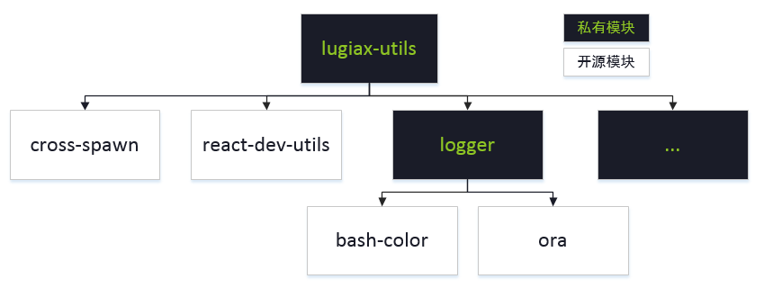
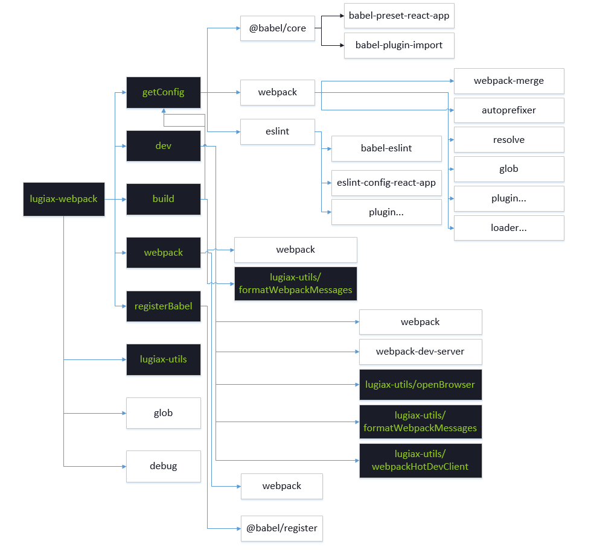
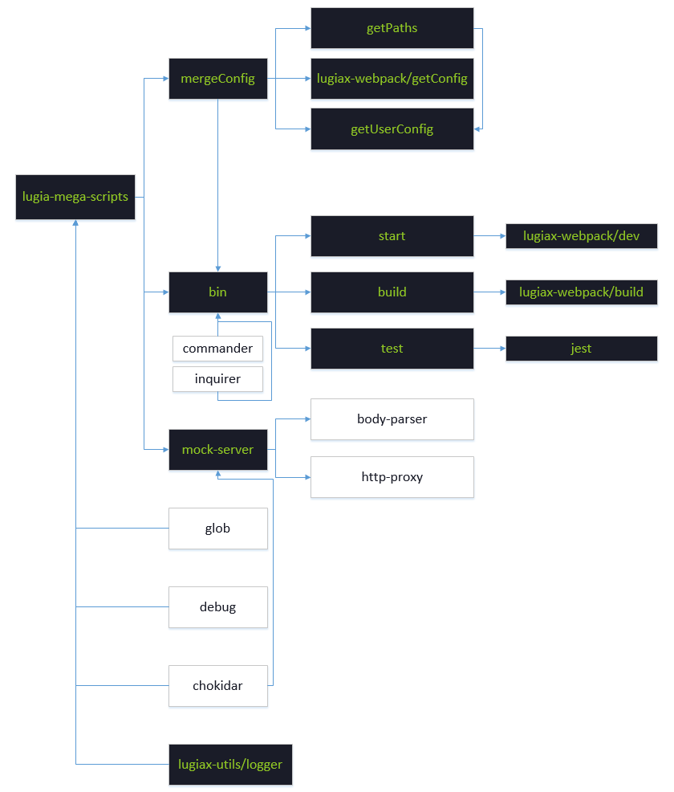
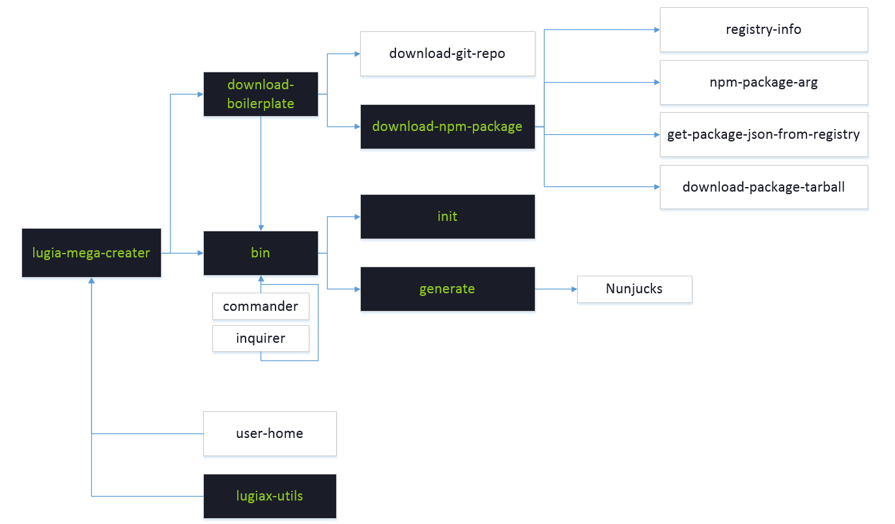
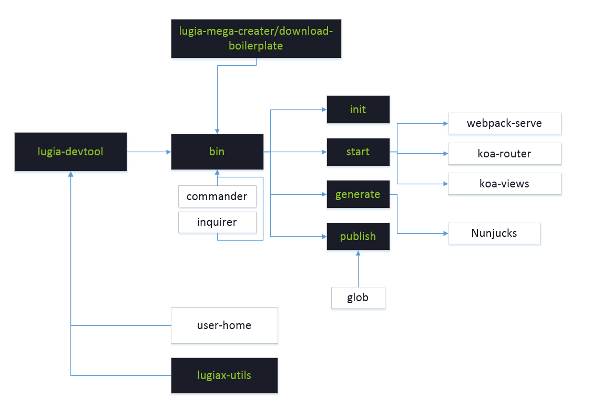
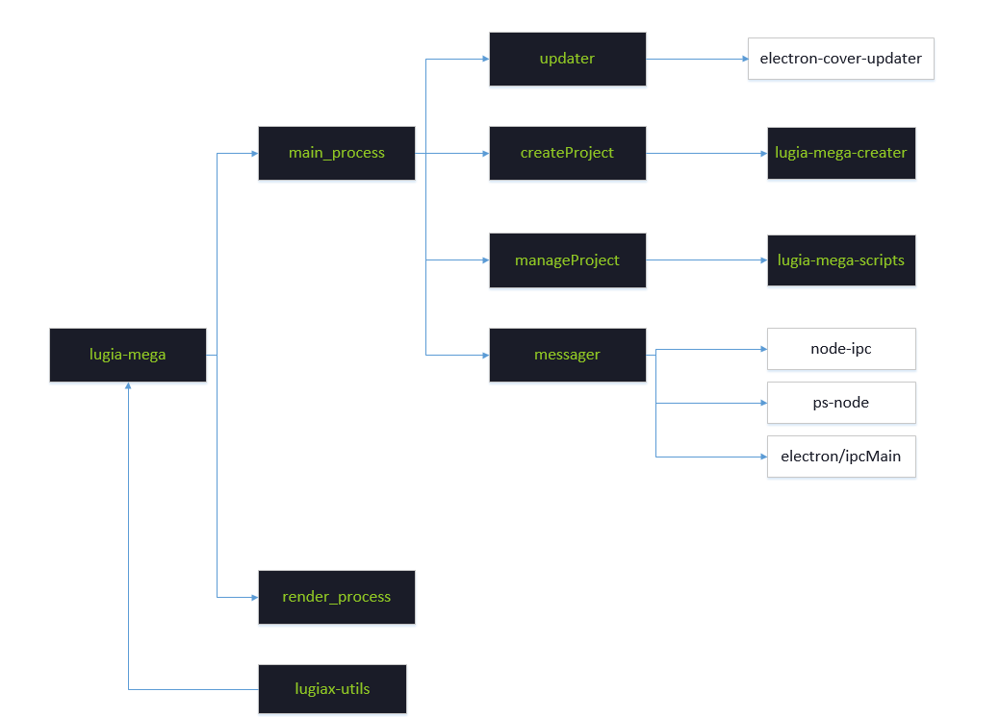

# lugia-mega 模块设计

## mega-utils

> 一些实用的工具函数，主要为 `mega-scripts`, `mega-creater`, `lugia-devtool`, `mega-webpack` 服务。

**包含**

- 文件的读写、处理
- 路径的处理
- 命令行界面工具，颜色、清屏、状态、日志输出......
- 私有的 `babel` preset 和 plugin
- 私有的 `webpack` loader 和 plugin
- 私有的 `gulp` plugin



**相关**

- [babel](https://github.com/babel/babel)
- [webpack](https://github.com/webpack/webpack)
- [gulp](https://github.com/gulpjs/gulp)
- [bash-color](https://github.com/mbilokonsky/bash-color)
- [react-dev-utils](https://github.com/facebook/create-react-app/blob/next/packages/react-dev-utils/README.md)
- [cross-spawn](https://github.com/moxystudio/node-cross-spawn)
- [ora](https://github.com/sindresorhus/ora)

## mega-webpack

> 对 `webpack` 的封装，零配置使用



### API

**mega-webpack/getConfig**

通过参数获取 webpack 配置

在开发或者构建时使用，会获取预设的配置，包含构建 react 技术栈应用的所有 loader 和 plugin

```js
const webpackConfig = getConfig(opts);
```

**mega-webpack/dev**

启动服务，开发

```js
dev({
  webpackConfig,
  beforeServer,
  afterServer,
  proxy,
  ...otherConfig
});
```

**mega-webpack/build**

打包构建

```js
build({
  webpackConfig,
  success,
  ...otherConfig
});
```

**mega-webpack/webpack**

webpack

**mega-webpack/registerBabel**

@babel/register

**相关**

- [debug](https://github.com/visionmedia/debug)
- [glob](https://github.com/isaacs/node-glob)
- [resolve](https://github.com/browserify/resolve)
- [webpack-merge](https://github.com/survivejs/webpack-merge)
- [babel-plugin-import](https://github.com/ant-design/babel-plugin-import)
- [autoprefixer](https://github.com/postcss/autoprefixer)
- [eslint](https://github.com/eslint/eslint)
- [babel-eslint](https://github.com/babel/babel-eslint)

## mega-scripts

react 应用开发工具，可配置版的 [create-react-app](https://github.com/facebook/create-react-app)

- 开箱即用，包含 start、build 和 test 命令
- React，JSX，ES6 和 Flow 语法支持
- 对 Less/Scss、css-modules、postcss、styled-components 的支持
- CSS Autoprefixer 前缀自动补全
- 交互式的单元测试，内置支持覆盖率报告功能；基于 jest，包括 UI 测试（基于 enzyme）
- mock 服务
- 实时调试服务，包含错误警告
- 打包构建脚本，把 js、css、图片及其他资源构建在一起，添加 hash 值和源码映射
- 配置支持，使用 JSON 格式的文件 `.lugiarc`



### 开始

```bash
## 安装
$ npm i mega-scripts -g

## 查看版本
$ mega-scripts -v
1.0.0

## 本地开发服务
$ mega-scripts start

## 打包构建
$ mega-scripts build

## 测试
$ mega-scripts test
```

### mock 服务

- 可以结合 `express` 使用
- 可以和 `webpack-dev-server` 结合使用

`.lugiarc.mock.js`

```js
export default {
  "GET /api/user": {
    id: 1,
    username: "kenny",
    sex: 6
  },
  "GET /api/user/list": [
    {
      id: 1,
      username: "kenny",
      sex: 6
    },
    {
      id: 2,
      username: "kenny",
      sex: 6
    }
  ],
  "POST /api/login/account": (req, res) => {
    const { password, username } = req.body;
    if (password === "888888" && username === "admin") {
      return res.json({
        status: "ok",
        code: 0,
        token: "sdfsdfsdfdsf",
        data: {
          id: 1,
          username: "kenny",
          sex: 6
        }
      });
    } else {
      return res.json({
        status: "error",
        code: 403
      });
    }
  },
  "DELETE /api/user/:id": (req, res) => {
    console.log("---->", req.body);
    console.log("---->", req.params.id);
    res.send({ status: "ok", message: "删除成功！" });
  }
};
```

**相关**

- [chokidar](https://github.com/paulmillr/chokidar)
- [commander](https://github.com/tj/commander.js) 让命令行界面开发变得简单
- [inquirer](https://github.com/SBoudrias/Inquirer.js) 更好的命令行交互
- [body-parser](https://github.com/expressjs/body-parser)
- [http-proxy](https://github.com/nodejitsu/node-http-proxy)

## mega-creater

快速创建 React App，基于 redux、redux-lugia 和 react-router。

- 零配置，包含 init 和 generate (别名 g) 命令
- 在 macOS、Windows、Linux 上使用
- 轻量级，易学易用
- 支持 mobile 和 react-native
- 支持 HMR
- 动态加载 Model 和 Router：按需加载加快访问速度



### 开始

```bash
## 安装
$ npm i mega-creater -g

## 查看版本
$ mega-creater -v
1.0.0

## 初始化一个 react app
$ mega-creater init [dir] [options]

## 生成 model
$ mega-creater g model [options]

## 生成 page
$ mega-creater g page [layout] [blocks] [options]
```

**相关**

- [user-home](https://github.com/sindresorhus/user-home) 跨平台获取用户根目录
- [Nunjucks](https://github.com/mozilla/nunjucks) 功能强大的模板引擎
- [download-git-repo](https://github.com/flipxfx/download-git-repo)

## lugia-devtool

物料库开发者工具

- 提供 init、generate (别名 g)、start、publish 命令
- 满足自定义物料体系的能力
- 支持自定义开发区块、布局、模板
- 在 macOS、Windows、Linux 上使用
- ~~轻量级~~，易学易用，舒适的**交互式**命令行体验
- 支持 HMR



### 开始

```bash
## 安装
$ npm i lugia-devtool -g

## 查看版本
$ lugia-devtool -v
1.0.0

## 初始化一个 基础物料库
$ lugia-devtool init [dir]

## 启动本地服务，预览各个区块、布局、模板
$ lugia-devtool start

## 生成 新的物料（区块、布局、模板）
$ lugia-devtool g

## 发布物料库
$ lugia-devtool publish
```

## lugia-mega


